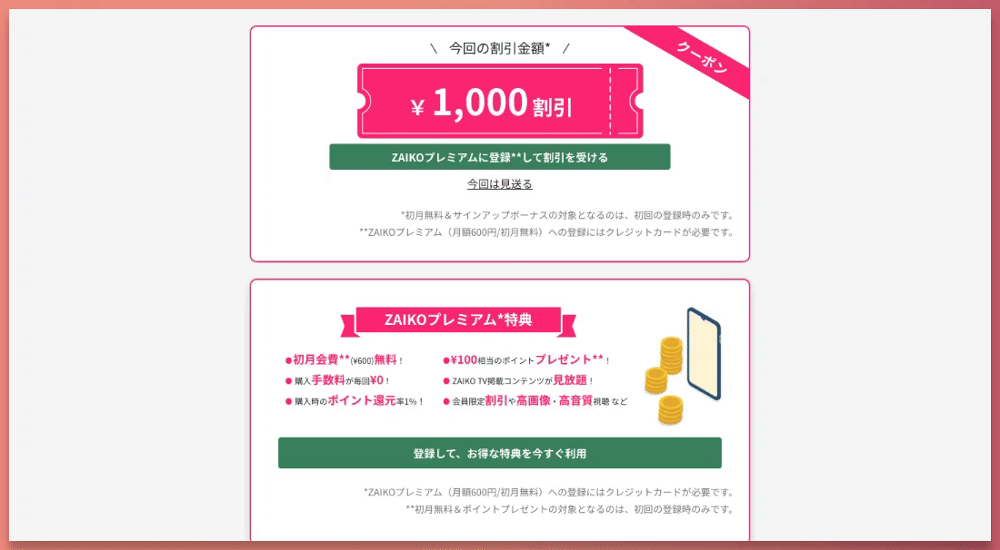

# Zaiko Vue Test Submission - Travis Ricks

Thank you for this opportunity. I had a lot of fun implementing these components and I look forward to discussing them with you.

## Demo

<a href="https://competent-pasteur-9084ea.netlify.app/" target="_blank"></a>

View a [working demo](https://competent-pasteur-9084ea.netlify.app/) hosted on Netlify.

## Overall Notes

- Implemented with Vue3, Bootstrap, and Sass
- To make the components reusable and flexible, I created Sass variables and mixins. The variables allow the main pink and green colors to be changed globally. These could also be refactored to Vue props on the components. The mixins help with preventing code duplication.
- Whenever necessary, fluid type sizing was used for smooth transitions between different screen sizes.
- The Avenir font was specified in `App.vue`, but it doesn't appear to be a free font or to have Japanese characters, so I would expect this to look different on a device that has Avenir installed. I would recommend changing to a font like Noto Sans JP or including Avenir in the repository.

## Task 1: Coupon Component


### Features

- Fully-responsive component
- Hover and focus styles are included for the links.
- Created a Sass mixin to more easily apply all necessary states for links.
- The coupon amount is passed in as a prop and formatted with commas when necessary.
- Text selection is disabled on the クーポン ribbon for improved usability.
- Green color was darkened to pass contrast guidelines.
- The 'terms and conditions' text is flush-left on smaller screens to help with readability.
- **Stretch:** Recreated the coupon background as an SVG for more flexibility.

## Task 2: Premium Component


### Features

- Fully-responsive component
- Use of CSS Grid to achieve the responsive designs.
- The coin gif had extra white space in the file, so I edited it so it could be positioned more accurately with CSS.
- **Stretch:** Recreated the ribbon background as an SVG for more flexibility. Also to make it more responsive, the sides of the ribbon are hidden on very small screens (< 275px).

## Task 3: API Interaction Component


### Features

- Loading spinner is displayed during API call. (For the sake of the demo I have added a setTimeout since the local fetch is so fast).
- Items are dynamically styled based on drink type.
- There is an error screen if the API is unavailable. You can simulate this from the dropdown menu.
- Fully-responsive component
- **Stretch:** I added sorting options for the data: Price, Alphabetical, and Type.

## Run Locally

Here are instructions to get this running on your local machine.

Clone the project

```bash
  git clone https://github.com/travisricks/zaiko-exercise-vue
```

Go to the project directory

```bash
  cd zaiko-exercise-vue
```

Install dependencies

```bash
  npm install
```

Start it up! 🚀

```bash
  npm run serve
```
